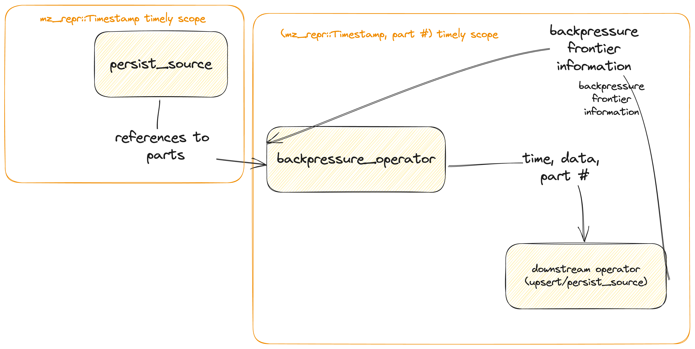

# Total Backpressure for Sources

- Associated: <https://github.com/MaterializeInc/materialize/issues/17067>

<!--
The goal of a design document is to thoroughly discover problems and
examine potential solutions before moving into the delivery phase of
a project. In order to be ready to share, a design document must address
the questions in each of the following sections. Any additional content
is at the discretion of the author.

Note: Feel free to add or remove sections as needed. However, most design
docs should at least keep the suggested sections.
-->

## The Problem

<!--
What is the user problem we want to solve?

The answer to this question should link to at least one open GitHub
issue describing the problem.
-->

Source dataflows can be summarized as a set of io-bound inputs connected to a set of io-bound
outputs (specifically, a set of `persist_sink`s) through a series of transformations.

Some of those transformations can also be io-bound (in particular, the `upsert` operator used by
`ENVELOPE UPSERT/DEBEZIUM` when backed by an attached disks.

---

Its important to realize that if the inputs and downstream operators can be _impedance-mismatched_.
If the set of inputs produces data slower than downstream operators can process it, we see reduced
utilization. If the inputs produce data faster than the downstream operators, we see increased
resource utilization. In particular we see an increase in memory as data is buffered for processing.

_Because the inputs are user-defined, it is impossible categorically impedance match the inputs with
the downstream operators, which Materialize controls._

Because of this, we are required to _artificially govern_ inputs to ensure sources have coherent and
consistent resource utilization. We refer to this as _backpressure_, though it is sometimes called
_flow_control.

---

We currently have backpressure implemented and deployed for some cases (namely, _rehydrating_
(restarting) upsert/debezium sources that use disk-attached replicas). This has been largely
successful, but there is increasing need for backpressure for all types of sources, across their
entire lifecycle. This reduces the complexity of sizing and maintaining sources for users.

This design document defines how backpressure will be _broadly_ implemented in storage dataflows.

## Success Criteria

This design is successful if the users can freely scale their source clusters up and down,
and can thoroughly discover performance boundaries.

## Out of Scope

- Backpressure for `SINK` dataflows.

## Solution Proposal

There are 3 _phases_ running sources experience:

- _Hydration_, when a source have just been created and is consuming the upstream service's full history.
- _Steady-state_, when a source has finished _hydration_, and is now consuming data at the end of the upstream
service.
- _Rehydration_, when a source is being restarting (during a maintenance window or otherwise) and (may) need to
re-index historical data stored in persist.

The proposed solution is to use a [faucet-style](https://andrea.lattuada.me/assets/faucet-beyondmr16.pdf)
approach to 

<!--
What is your preferred solution, and why have you chosen it over the
alternatives? Start this section with a brief, high-level summary.

This is your opportunity to clearly communicate your chosen design. For any
design document, the appropriate level of technical details depends both on
the target reviewers and the nature of the design that is being proposed.
A good rule of thumb is that you should strive for the minimum level of
detail that fully communicates the proposal to your reviewers. If you're
unsure, reach out to your manager for help.

Remember to document any dependencies that may need to break or change as a
result of this work.
-->

## Minimal Viable Prototype

<!--
Build and share the minimal viable version of your project to validate the
design, value, and user experience. Depending on the project, your prototype
might look like:

- A Figma wireframe, or fuller prototype
- SQL syntax that isn't actually attached to anything on the backend
- A hacky but working live demo of a solution running on your laptop or in a
  staging environment

The best prototypes will be validated by Materialize team members as well
as prospects and customers. If you want help getting your prototype in front
of external folks, reach out to the Product team in #product.

This step is crucial for de-risking the design as early as possible and a
prototype is required in most cases. In _some_ cases it can be beneficial to
get eyes on the initial proposal without a prototype. If you think that
there is a good reason for skpiping or delaying the prototype, please
explicitly mention it in this section and provide details on why you you'd
like to skip or delay it.
-->

## Alternatives

<!--
What other solutions were considered, and why weren't they chosen?

This is your chance to demonstrate that you've fully discovered the problem.
Alternative solutions can come from many places, like: you or your Materialize
team members, our customers, our prospects, academic research, prior art, or
competitive research. One of our company values is to "do the reading" and
to "write things down." This is your opportunity to demonstrate both!
-->

## Open questions

<!--
What is left unaddressed by this design document that needs to be
closed out?

When a design document is authored and shared, there might still be
open questions that need to be explored. Through the design document
process, you are responsible for getting answers to these open
questions. All open questions should be answered by the time a design
document is merged.
-->
